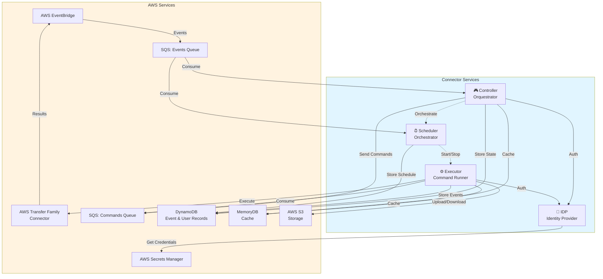
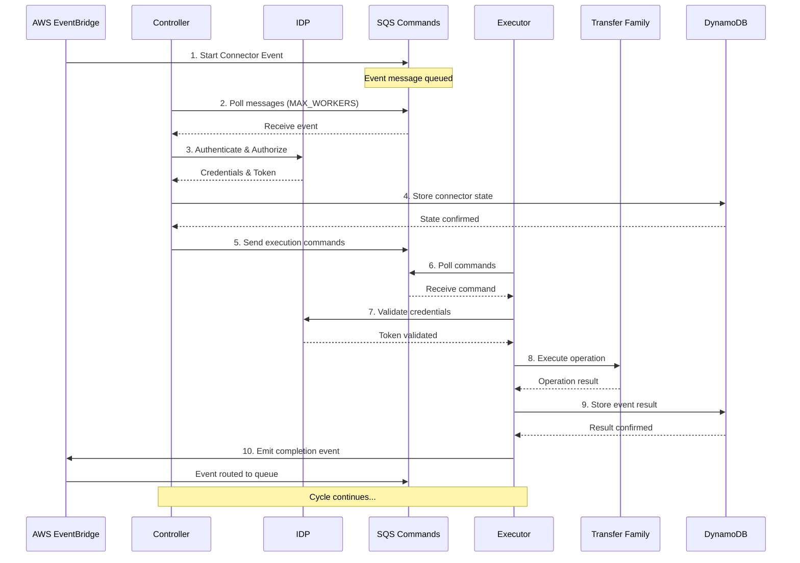
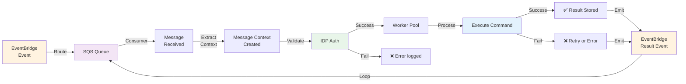
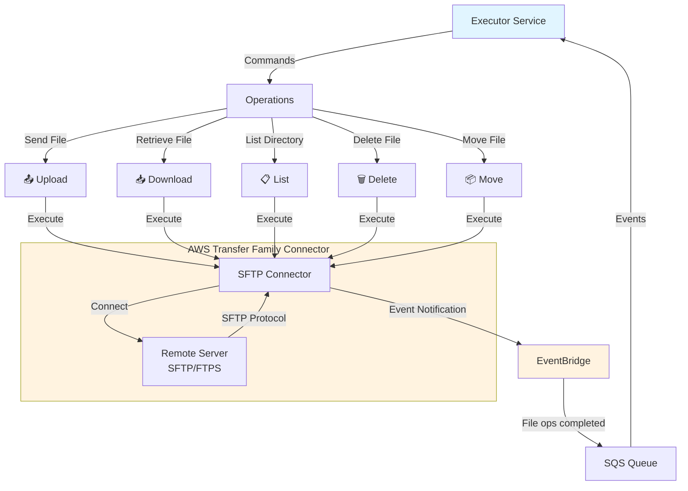
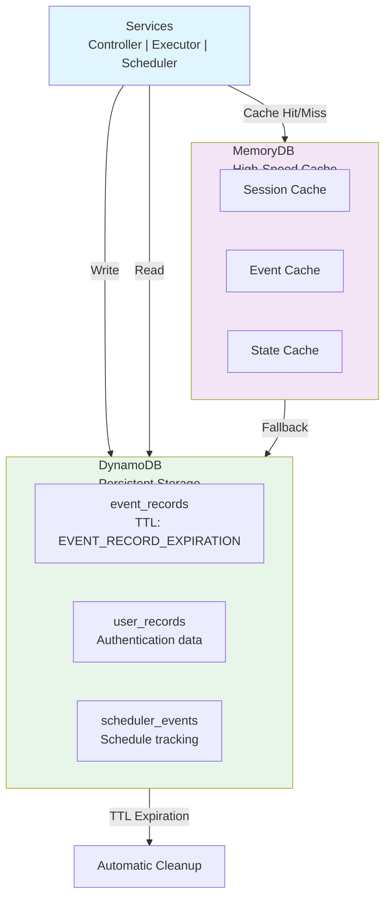

# AWS Connector

Um projeto Go que integra com o **AWS Transfer Family Connector** para orquestrar e gerenciar operações de transferência de arquivos através do AWS EventBridge e AWS SQS.

## Visão Geral

O AWS Connector é uma aplicação distributed que processa eventos do AWS Transfer Family Connector, orquestra múltiplos workers e executa operações de transferência de dados em ambientes AWS. O projeto é instrumentado com OpenTelemetry para coleta de métricas, traces e logs.

### Principais Características

- **Processamento de Eventos**: Consome eventos do AWS EventBridge através de filas AWS SQS
- **Orquestração de Conectores**: Gerencia inicialização e encerramento de múltiplos conectores
- **Execução de Comandos**: Executa operações (envio, recebimento, listagem, exclusão de arquivos)
- **Observabilidade**: Integração completa com OpenTelemetry para tracing, métricas e logs
- **Escalabilidade**: Suporta múltiplos workers paralelos para processamento de mensagens
- **Persistência**: Integração com DynamoDB e MemoryDB para armazenamento de dados

## Arquitetura

O projeto é composto por quatro serviços principais que trabalham em conjunto:

### Componentes

1. **Controller**: Orquestra o ciclo de vida dos conectores do AWS Transfer Family
   - Recebe eventos de inicialização e encerramento do EventBridge
   - Gerencia o estado dos conectores
   
2. **Executor**: Executa comandos nos conectores
   - Processa fila de comandos
   - Executa operações: enviar, receber, listar, deletar arquivos
   
3. **Scheduler**: Agenda e coordena operações periódicas
   - Controla cronograma de execuções
   - Gerencia limpeza de dados expirados
   
4. **IDP**: Identity Provider
   - Autentica e autoriza operações
   - Gerencia credenciais e identidades

### Diagrama de Arquitetura Geral



## Fluxo de Eventos

Entenda como uma operação flui através do sistema:



### Fluxo de Processamento Simplificado



## Integração com AWS Transfer Family

O Executor se integra diretamente com o AWS Transfer Family Connector para executar operações de arquivo:



## Persistência de Dados

A aplicação utiliza múltiplas camadas de armazenamento para garantir performance e confiabilidade:



## Estrutura do Projeto

```
awsconnector/
├── cmd/                    # Aplicações executáveis
│   ├── controller/        # Serviço de orquestração de conectores
│   ├── executor/          # Serviço de execução de comandos
│   ├── scheduler/         # Serviço de agendamento
│   └── idp/               # Serviço de identidade
├── internal/              # Código compartilhado interno
│   ├── repository/        # Camada de acesso a dados (DynamoDB, MemoryDB)
│   ├── event_bridge.go    # Integração com EventBridge
│   ├── message_context.go # Contexto de mensagens
│   └── utils.go           # Utilitários gerais
├── pkg/                   # Pacotes públicos (se houver)
└── terraform/             # Infraestrutura como código para AWS
```

## Requisitos

- **Go**: 1.25.5 ou superior
- **AWS CLI**: Para configurar credenciais
- **Variáveis de Ambiente AWS**: `AWS_REGION`, `AWS_ACCESS_KEY_ID`, `AWS_SECRET_ACCESS_KEY`

### Dependências Go Principais

- AWS SDK v2 para DynamoDB, S3, SQS, Lambda, Transfer Family
- OpenTelemetry para observabilidade (tracing, métricas, logs)
- AWS Lambda Go para deployments serverless

## Variáveis de Ambiente

Todos os serviços requerem as seguintes variáveis de ambiente:

- **`OTEL_SERVICE_NAME`** (obrigatório): Nome do serviço para telemetria
- **`SQS_EVENT_BRIDGE_URL`**: URL da fila SQS para consumir eventos do EventBridge
- **`SQS_COMMAND_URL`**: URL da fila SQS para enviar/receber comandos
- **`MAX_WORKERS`**: Quantidade de workers paralelos (padrão: 10)
- **`MAX_COMMANDS`**: Máximo de comandos paralelos no conector
- **`EVENT_RECORD_EXPIRATION`**: TTL em segundos para registros de eventos no DynamoDB

## Compilação e Execução

### Build

```bash
# Build do Controller
go build -o bin/controller ./cmd/controller

# Build do Executor
go build -o bin/executor ./cmd/executor

# Build do Scheduler
go build -o bin/scheduler ./cmd/scheduler

# Build do IDP
go build -o bin/idp ./cmd/idp
```

### Execução Local

```bash
# Configurar variáveis de ambiente
export OTEL_SERVICE_NAME="controller"
export SQS_EVENT_BRIDGE_URL="https://sqs.region.amazonaws.com/account/queue-name"
export SQS_COMMAND_URL="https://sqs.region.amazonaws.com/account/command-queue"

# Executar serviço
./bin/controller
```

### Deployment com Lambda

Os serviços podem ser deployados como funções AWS Lambda. O projeto inclui configuração Terraform para provisionar toda a infraestrutura necessária.

## Observabilidade

O projeto usa OpenTelemetry para coleta integrada de:

- **Traces**: Rastreamento distribuído de requisições através dos serviços
- **Métricas**: Coleta de runtime e métricas de negócio
- **Logs**: Logs estruturados com contexto de trace

Configure as exporters do OTel através de variáveis de ambiente:

- `OTEL_EXPORTER_OTLP_ENDPOINT`: Endpoint do coletor OTLP
- `OTEL_EXPORTER_OTLP_PROTOCOL`: Protocolo (grpc/http)

## Infraestrutura (Terraform)

O diretório `terraform/` contém a configuração completa da infraestrutura AWS:

- **Lambda Functions**: Deployment automático dos serviços
- **SQS Queues**: Filas para eventos e comandos
- **DynamoDB Tables**: Persistência de estado e eventos
- **EventBridge Rules**: Roteamento de eventos
- **IAM Roles**: Permissões necessárias
- **S3 Buckets**: Armazenamento de dados
- **Transfer Family**: Configuração dos conectores SFTP

## Desenvolvimento

### Estrutura de Código

- `internal/repository/`: Implementações de acesso a dados (DynamoDB, MemoryDB)
- `cmd/*/sqs_consumer.go`: Consumidor de mensagens SQS (genérico)
- `cmd/*/worker.go`: Processador de tarefas (genérico)
- `cmd/*/otel.go`: Inicialização do OpenTelemetry

### Padrão de Comunicação Entre Serviços

Os serviços se comunicam **exclusivamente** através de:

1. **SQS Queues**: Comunicação assíncrona entre serviços
   - `SQS_EVENT_BRIDGE_URL`: Fila para eventos do EventBridge (Controller e Scheduler consomem)
   - `SQS_COMMAND_URL`: Fila para comandos (Executor consome)

2. **EventBridge**: Notificação de eventos completados
   - Transfer Family publica eventos de conclusão
   - Eventos são roteados de volta para SQS

3. **DynamoDB**: Compartilhamento de estado durável
   - `event_records`: Histórico de eventos com TTL
   - `user_records`: Dados de autenticação de usuários
   - `scheduler_events`: Estado de agendamentos

4. **MemoryDB**: Cache distribuído (opcional)
   - Reduz latência de lookups
   - Cache hit em operações frequentes

### Lifecycle de uma Requisição

1. **Routing EventBridge** → **SQS Queue** (ms)
2. **Controller/Scheduler Poll** → até `MAX_WORKERS` mensagens (1-2s)
3. **Authentication** → IDP valida credenciais (200ms)
4. **State Storage** → DynamoDB persiste estado (50-100ms)
5. **Command Dispatch** → Enviado para `SQS_COMMAND_URL` (ms)
6. **Executor Poll** → até `MAX_WORKERS` comandos (1-2s)
7. **Execution** → Transfer Family executa operação (5-60s dependendo da operação)
8. **Result Publication** → EventBridge notifica conclusão (ms)
9. **Cycle Repeat** → Mensagem processada novamente

**Latência Total Esperada**: 10-120 segundos dependendo da operação

### Adicionar Novo Serviço

1. Criar diretório em `cmd/novo-servico/`
2. Implementar `main.go`, `otel.go`, `sqs_consumer.go`, `worker.go`
3. Adicionar build rules (Makefile ou build script)
4. Atualizar infraestrutura Terraform

### Tratamento de Erros e Resiliência

- **Retry Logic**: Mensagens falhadas retornam à fila SQS com visibilidade timeout
- **Dead Letter Queue**: Mensagens que falham múltiplas vezes são movidas para DLQ
- **Health Checks**: Cada serviço reporta status via observabilidade
- **Graceful Shutdown**: Sinais SIGTERM/SIGINT permitem processamento de mensagens em voo

## Licença

[Especificar licença do projeto]

## Contato

[Informações de contato ou suporte]
" 
